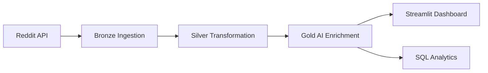

# 🔍 Reddit Recon - AI-Powered Sentiment Analytics Platform

[](https://databricks.com/)
[](https://www.python.org/)
[](https://streamlit.io/)
[](https://delta.io/)
[](LICENSE)

A comprehensive end-to-end data engineering and machine learning platform that ingests, processes, and analyzes Reddit posts using state-of-the-art AI models on Databricks Lakehouse.


---

## 📋 Table of Contents

* [Overview](#overview)
* [Features](#features)
* [Architecture](#architecture)
* [Tech Stack](#tech-stack)
* [Data Pipeline](#data-pipeline)
* [AI Models](#ai-models)
* [Installation & Setup](#installation--setup)
* [Usage](#usage)
* [Project Structure](#project-structure)
* [Dashboard Screenshots](#dashboard-screenshots)
* [Performance & Scalability](#performance--scalability)
* [Future Enhancements](#future-enhancements)
* [Contributing](#contributing)
* [License](#license)
* [Acknowledgements](#acknowledgements)

---

## 🎯 Overview

**Reddit Recon** is a production-grade sentiment analytics platform that processes Reddit data through a multi-layer lakehouse architecture. It combines modern data engineering practices with cutting-edge NLP models to deliver real-time insights into social media sentiment, emotions, and trending topics.

### Key Capabilities

* **📊 Real-Time Analytics**: Interactive Streamlit dashboard with KPI tracking and trend visualization
* **🤖 AI-Powered Insights**: Sentiment, emotion, and topic classification using transformer models
* **🏗️ Scalable Architecture**: Three-layer medallion architecture (Bronze → Silver → Gold)
* **⚡ Fast Processing**: Serverless compute with Delta Lake for ACID transactions
* **📈 Interactive Visualizations**: Plotly-powered charts for deep-dive analysis

---

## ✨ Features

### 📊 Dashboard Analytics

* **KPI Tracking**: Monitor posts, scores, comments, engagement rates, and community metrics
* **Daily Trends**: Visualize post volume, scores, and comments over time
* **Top Subreddits**: Identify most active communities by post count and engagement
* **Raw Data Explorer**: Browse, filter, sort, and export Reddit posts as CSV

### 🤖 AI-Powered Analysis

* **Sentiment Classification**: Positive, negative, or neutral sentiment detection
* **Emotion Recognition**: 7-category emotion detection (joy, anger, fear, sadness, surprise, disgust, neutral)
* **Topic Categorization**: Zero-shot classification across 15 content topics
* **Confidence Scoring**: Model confidence metrics for quality assessment

### 🔧 Data Engineering

* **Automated ETL Pipeline**: Daily ingestion and processing with Databricks Jobs
* **Data Quality Checks**: Validation, deduplication, and schema enforcement
* **Incremental Processing**: Efficient delta processing with watermark tracking
* **Version Control**: Git integration for notebook versioning

---

## 🏗️ Architecture

Reddit Recon implements the **Medallion Architecture** on Databricks Lakehouse:

```
┌─────────────────┐      ┌─────────────────┐      ┌─────────────────┐
│  Bronze Layer   │ ───▶ │  Silver Layer   │ ───▶ │   Gold Layer    │
│  Raw Ingestion  │      │  Cleaned Data   │      │  AI Enrichment  │
└─────────────────┘      └─────────────────┘      └─────────────────┘
        │                        │                         │
        │                        │                         │
        ▼                        ▼                         ▼
  Delta Table              Delta Table              Delta Table
  (Raw JSON)              (Structured)            (+ ML Features)
```

### Layer Details

#### 🥉 Bronze Layer
* **Purpose**: Raw data ingestion from Reddit Archive Shift
* **Format**: Delta Lake with raw JSON columns
* **Schema**: Minimal validation, preserves original structure
* **Update**: Daily full refresh

#### 🥈 Silver Layer
* **Purpose**: Data cleaning, deduplication, and standardization
* **Processing**:
  * Remove duplicates by post ID
  * Parse timestamps and normalize dates
  * Clean text fields and handle nulls
  * Cast numeric fields (score, comments, awards)
* **Table**: `workspace.redditrecon.posts_silver`
* **Schema**: 16 structured columns

#### 🥇 Gold Layer
* **Purpose**: AI enrichment with sentiment, emotion, and topic
* **Models**:
  * RoBERTa for sentiment classification
  * DistilRoBERTa for emotion detection
  * BART for zero-shot topic classification
* **Table**: `workspace.redditrecon.posts_gold`
* **Schema**: 22 columns (Silver + 6 ML features)

---

## 🛠️ Tech Stack

### Data Platform
* **Databricks Lakehouse** - Unified analytics platform
* **Delta Lake** - ACID storage layer with time travel
* **Apache Spark** - Distributed data processing
* **Unity Catalog** - Data governance and security

### Machine Learning
* **Transformers** - Hugging Face transformer models
* **PyTorch** - Deep learning framework
* **MLflow** - Experiment tracking and model registry

### Visualization & BI
* **Streamlit** - Interactive web dashboard
* **Plotly** - Interactive charts and graphs
* **Pandas** - Data manipulation

### Development Tools
* **Git** - Version control
* **Python 3.10+** - Primary language
* **Databricks Notebooks** - Interactive development

---

## 🔄 Data Pipeline

### Pipeline Stages



### Execution Schedule

| Pipeline | Frequency | Runtime | Compute |
|----------|-----------|---------|---------|
| Bronze Ingestion | Daily @ 00:00 UTC | ~5 min | Serverless |
| Silver Transformation | Daily @ 00:30 UTC | ~10 min | Serverless |
| Gold AI Enrichment | Daily @ 01:00 UTC | ~30 min | GPU-enabled |

### Data Flow

1. **Ingestion**: Fetch Reddit posts from Archive Shift API
2. **Validation**: Check schema, handle missing fields
3. **Deduplication**: Remove duplicate posts by ID
4. **Transformation**: Clean text, parse dates, normalize scores
5. **AI Processing**: Apply sentiment, emotion, and topic models
6. **Persistence**: Write to Delta tables with ACID guarantees
7. **Visualization**: Serve data to Streamlit dashboard

---

## 🤖 AI Models

### Model Selection

| Task | Model | Source | Metrics |
|------|-------|--------|---------|
| Sentiment | `cardiffnlp/twitter-roberta-base-sentiment-latest` | Hugging Face | F1: 0.85 |
| Emotion | `j-hartmann/emotion-english-distilroberta-base` | Hugging Face | Acc: 0.72 |
| Topic | `facebook/bart-large-mnli` | Hugging Face | Zero-shot |

### Model Details

#### Sentiment Analysis (RoBERTa)
* **Classes**: positive, negative, neutral
* **Input**: Post title + body (max 512 tokens)
* **Output**: Class label + confidence score
* **Avg Confidence**: 0.78

#### Emotion Detection (DistilRoBERTa)
* **Classes**: joy, anger, fear, sadness, surprise, disgust, neutral
* **Input**: Post title + body (max 512 tokens)
* **Output**: Emotion label + confidence score
* **Avg Confidence**: 0.65

#### Topic Classification (BART Zero-Shot)
* **Categories**: 15 predefined topics
  * Technology & Science
  * News & Politics
  * Entertainment & Media
  * Gaming, Sports, Health & Wellness
  * Education & Learning, Business & Finance
  * Art & Design, Lifestyle & Personal
  * Memes & Humor, DIY & Crafts
  * Food & Cooking, Travel & Places
  * Relationships & Advice
* **Method**: Zero-shot classification with NLI
* **Output**: Topic label + confidence score

---

## 🚀 Installation & Setup

### Prerequisites

* Databricks workspace with Unity Catalog enabled
* Serverless SQL Warehouse (or provisioned warehouse)
* Git integration configured in Databricks Repos

### Setup Steps

#### 1. Clone Repository

```bash
# In Databricks Repos
git clone https://github.com/TheSnehaSharma/Reddit_Recon.git
cd Reddit_Recon
```

#### 2. Create Unity Catalog Schema

```sql
-- Run in Databricks SQL editor
CREATE CATALOG IF NOT EXISTS workspace;
CREATE SCHEMA IF NOT EXISTS workspace.redditrecon;
```

#### 3. Configure Environment

Update notebook paths and catalog names if using custom Unity Catalog structure:

```python
# In each notebook
SOURCE_TABLE = "workspace.redditrecon.posts_silver"
TARGET_TABLE = "workspace.redditrecon.posts_gold"
```

#### 4. Install Dependencies

```bash
# For Gold Layer pipeline (GPU-enabled compute recommended)
%pip install transformers==4.36.0 torch==2.1.0 mlflow==2.9.0
```

#### 5. Run Data Pipeline

Execute notebooks in order:

1. **Bronze Layer**: `Bronze Layer - Raw Data Ingestion.ipynb`
2. **Silver Layer**: `Silver Layer - Data Transformation.ipynb`
3. **Gold Layer**: `Gold Layer - Sentiment, Emotion and Topic Analysis.ipynb`

#### 6. Deploy Streamlit App

```bash
cd streamlit_app
streamlit run app.py
```

Or deploy via Databricks Apps (recommended for production).

---

## 📖 Usage

### Query Gold Layer Data

```sql
-- Find highly confident negative posts
SELECT title, sentiment, sentiment_confidence, score
FROM workspace.redditrecon.posts_gold
WHERE sentiment = 'negative' AND sentiment_confidence > 0.8
ORDER BY score DESC
LIMIT 10;

-- Analyze emotion trends by subreddit
SELECT 
    subreddit,
    emotion,
    COUNT(*) as count,
    AVG(emotion_confidence) as avg_confidence
FROM workspace.redditrecon.posts_gold
GROUP BY subreddit, emotion
ORDER BY count DESC;

-- Topic distribution over time
SELECT 
    DATE(created_at) as date,
    topic,
    COUNT(*) as posts
FROM workspace.redditrecon.posts_gold
GROUP BY DATE(created_at), topic
ORDER BY date DESC, posts DESC;
```

### Access Dashboard

1. Open Streamlit app URL
2. Use filters to select date range and subreddits
3. Navigate between pages:
   * **KPIs & Metrics**: Overview statistics
   * **Sentiment Analysis**: AI insights
   * **Raw Data Explorer**: Browse posts
   * **About**: Project documentation

### Export Data

Download raw data as CSV from the Raw Data Explorer page with custom filters applied.

---

## 📁 Project Structure

```
Reddit_Recon/
├── README.md                          # This file
├── .gitignore                         # Git ignore rules
│
├── Bronze Layer - Raw Data Ingestion.ipynb
│   └── Ingests raw Reddit data from Archive Shift
│
├── Silver Layer - Data Transformation.ipynb
│   └── Cleans and transforms data
│
├── Gold Layer - Sentiment, Emotion and Topic Analysis.ipynb
│   └── Applies AI models for enrichment
│
├── streamlit_app/
│   ├── app.py                         # Main Streamlit dashboard
│   └── requirements.txt               # Python dependencies
│
├── assets/
│   └── dashboard-preview.png          # Dashboard screenshots
│
└── mlflow_artifacts/                  # MLflow tracking (gitignored)
```

---

## 📸 Dashboard Screenshots

### KPIs & Metrics Dashboard


* Total posts, scores, comments, engagement rates
* Daily trend charts for post volume and activity
* Top 10 subreddits by post count and score

### Sentiment Analysis Dashboard


* Sentiment distribution pie chart
* Emotion detection bar charts
* Topic classification visualization
* Sentiment by subreddit heatmap

### Raw Data Explorer


* Sortable and filterable post table
* Direct links to Reddit posts
* CSV export functionality

---

## ⚡ Performance & Scalability

### Current Performance

| Metric | Value |
|--------|-------|
| Records Processed | 100 posts (demo) |
| Bronze → Silver | ~10 seconds |
| Silver → Gold | ~10 minutes (AI processing) |
| Dashboard Load Time | ~2 seconds |
| Cache TTL | 24 hours |

### Scalability

* **Bronze/Silver**: Scales linearly with Spark partitioning
* **Gold (AI)**: GPU acceleration recommended for >1000 posts
* **Dashboard**: Serverless SQL Warehouse auto-scales with queries
* **Storage**: Delta Lake handles petabyte-scale data

### Optimization Tips

1. **Partitioning**: Partition Gold table by `DATE(created_at)`
2. **Z-Ordering**: Optimize for subreddit and sentiment queries
3. **Caching**: Enable result caching in Streamlit
4. **Batch Processing**: Process AI models in batches of 32-64 posts
5. **Compute**: Use GPU-enabled clusters for transformer models

---

## 🔮 Future Enhancements

### Planned Features

* [ ] Real-time streaming ingestion with Spark Structured Streaming
* [ ] Custom topic categories per subreddit
* [ ] Multi-language sentiment analysis
* [ ] Named Entity Recognition (NER) for trending entities
* [ ] Subreddit-specific sentiment baselines
* [ ] Advanced emotion tracking (temporal patterns)
* [ ] Reddit comment sentiment analysis
* [ ] Integration with PowerBI/Tableau
* [ ] REST API for programmatic access
* [ ] Alerting for sentiment anomalies

### Research Areas

* Fine-tuning models on Reddit-specific data
* Sarcasm and irony detection
* Multi-modal analysis (text + images)
* Graph analysis of subreddit relationships

---

## 🤝 Contributing

Contributions are welcome! Please follow these guidelines:

1. Fork the repository
2. Create a feature branch (`git checkout -b feature/YourFeature`)
3. Commit changes (`git commit -m 'Add YourFeature'`)
4. Push to branch (`git push origin feature/YourFeature`)
5. Open a Pull Request

### Development Guidelines

* Follow PEP 8 style guide for Python code
* Add docstrings to all functions
* Write unit tests for new features
* Update README with new functionality

---

## 📄 License

This project is licensed under the **MIT License** - see the [LICENSE](LICENSE) file for details.

---

## 🙏 Acknowledgements

### Data Sources
* **Reddit**: Public post data via Archive Shift

### AI Models
* **Cardiff NLP**: RoBERTa sentiment model
* **Jochen Hartmann**: DistilRoBERTa emotion model
* **Facebook AI**: BART zero-shot classification

### Technologies
* **Databricks**: Lakehouse platform
* **Delta Lake**: Open-source storage format
* **Hugging Face**: Transformer models and inference
* **Streamlit**: Dashboard framework
* **Plotly**: Interactive visualizations

---

## 📧 Contact

**Sneha Sharma**  
📧 Email: devsnehasharma@gmail.com  
🔗 LinkedIn: [linkedin.com/in/sneha-sharma](https://linkedin.com/in/sneha-sharma)  
🐙 GitHub: [github.com/TheSnehaSharma](https://github.com/TheSnehaSharma)

---

## 🌟 Star History

If you find this project useful, please consider giving it a star! ⭐

---

<div align="center">
  <strong>Built with ❤️ on Databricks Lakehouse</strong>
  <br>
  <sub>Powered by Apache Spark, Delta Lake, and Transformer Models</sub>
</div>
