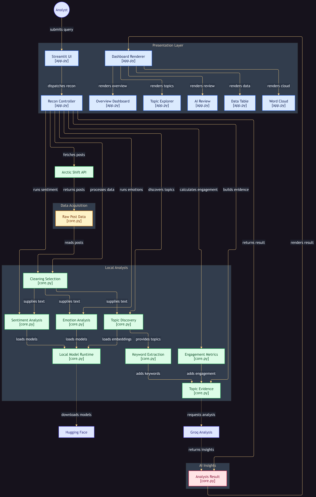
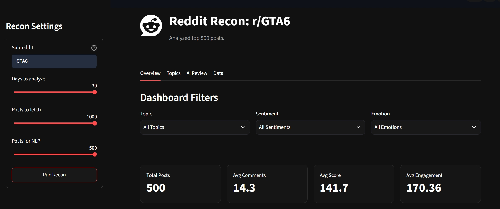
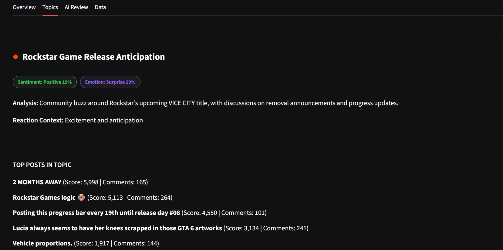
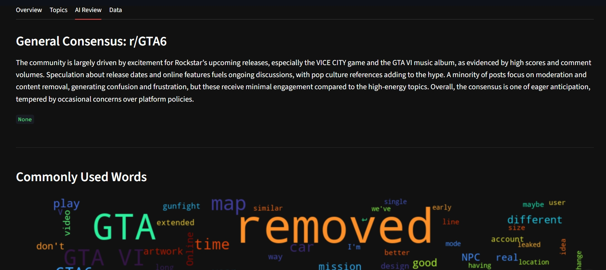
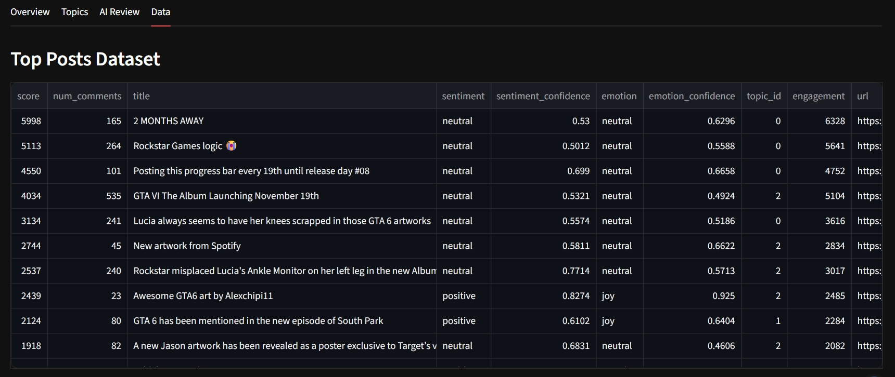

<h1 align="center">REDDIT RECON</h1>

  <strong>AI-Powered Reddit Intelligence & Discussion Analytics</strong>
   
  Turn Reddit conversations into structured insights about sentiment, emotions, topics, and engagement.

---

## 🚀 What is Reddit Recon ?

**Reddit Recon** is an AI-powered analytics platform that transforms Reddit discussions into an interactive intelligence dashboard.

Instead of manually reading hundreds of posts, Reddit Recon helps you understand:

- 💬 **What people are discussing**
- 😊 **How they feel**
- 🎭 **Which emotions appear**
- 🧩 **Which topics emerge**
- 📈 **Which discussions receive the most engagement**
- 🤖 **How an LLM interprets the discovered discussion themes**

> 🔴 **Turn Reddit discussions into structured intelligence.**

---

## 🏗️ Architecture

Reddit Recon combines Reddit data retrieval, NLP, semantic embeddings, unsupervised machine learning, and LLM-based interpretation into one analysis pipeline.

### How It Works ?

**1. Reddit Data Retrieval**  
The user enters a subreddit and analysis parameters. Reddit Recon retrieves the relevant posts through the **Arctic Shift API**.

**2. Text & NLP Processing**  
Posts are cleaned and analyzed using pretrained models for **sentiment** and **emotion classification**.

**3. Semantic Representation**  
Each post is converted into a semantic embedding using **Sentence Transformers / MiniLM**.

**4. Topic Discovery**  
**K-Means clustering** groups semantically similar discussions. Candidate cluster counts are evaluated using cosine-based silhouette scoring.

**5. Topic Interpretation**  
**TF-IDF** extracts representative keywords from each cluster, while an LLM generates readable topic names and summaries from the extracted evidence.

**6. Interactive Analysis**  
The resulting insights are presented through four dashboard views: **Overview, Topics, AI Review, and Data**.

---

## 🛠️ Tech Stack

- `Python` — Core application and data-processing language
- `Streamlit` — Interactive web application and dashboard
- `Arctic Shift API` — Reddit post retrieval
- `Pandas & NumPy` — Data processing and numerical computation
- `CardiffNLP RoBERTa` — Sentiment classification
- `Fast Emotion Classifier` — Emotion detection
- `Sentence Transformers / MiniLM` — Semantic text embeddings
- `Scikit-learn K-Means` — Unsupervised topic clustering
- `TF-IDF` — Topic keyword extraction
- `GPT-OSS-20B` — AI-powered topic naming and discussion summarization
- `Groq` — Fast LLM inference
- `Plotly & Matplotlib` — Data visualization
- `WordCloud` — Topic vocabulary visualization
---

## 📖 How to Use ?

### 1. Overview — Select & Analyze

Enter the **subreddit name**, configure the available analysis parameters, and start the analysis.

Reddit Recon retrieves the posts and processes them through the complete NLP and topic-discovery pipeline.

The Overview dashboard then gives you a high-level view of:

- Sentiment distribution
- Emotion patterns
- Engagement
- Discussion activity
- Key analytical statistics

---

### 2. Topics — Discover What People Discuss

Open the **Topics** tab to explore the themes automatically discovered from the Reddit discussions.

You can examine:

- Discovered topics
- Topic distribution
- Topic size
- Representative keywords
- Topic engagement
- Supporting discussions

This turns individual posts into broader semantic discussion themes.

---

### 3. AI Review — Understand the Discussion

The **AI Review** tab uses the discovered topic evidence to generate a human-readable interpretation of the discussion.

It provides:

- AI-generated topic names
- Topic descriptions
- Discussion summaries
- Recurring patterns across analyzed posts

The LLM acts as an interpretation layer over the underlying NLP and clustering results.

---

### 4. Data — Inspect the Source Discussions

The **Data** tab lets you inspect the Reddit posts behind the analysis.

Use it to connect the aggregated insights back to the underlying discussions and understand the data contributing to the results.

---

## ✨ Key Features

- **Reddit Discussion Intelligence** — Transform Reddit discussions into structured analytical insights.
- **Sentiment Analysis** — Identify positive, neutral, and negative discussion patterns.
- **Emotion Detection** — Discover granular emotional patterns beyond basic sentiment.
- **Automatic Topic Discovery** — Discover semantic discussion themes without predefined categories.
- **TF-IDF Keywords** — Extract representative keywords from discovered topics.
- **LLM-Powered Interpretation** — Generate readable topic names and summaries from analytical evidence.
- **Engagement Analysis** — Analyze discussion activity using post scores and comment counts.
- **Interactive Dashboard** — Explore results through Overview, Topics, AI Review, and Data views.
- **Post-Level Transparency** — Connect analytical results back to the underlying Reddit discussions.
- **Cached ML Resources** — Reduce repeated model loading and computation during Streamlit reruns.
- **End-to-End Pipeline** — Combine Reddit retrieval, NLP, clustering, and generative AI in one workflow.

---

## 🤝 Contributing

Contributions, issues, and feature requests are welcome.

1. Fork the repository.
2. Create a feature branch.
3. Make your changes.
4. Commit and push your changes.
5. Open a Pull Request.

For larger changes, please describe the motivation and expected behavior in the PR.

---

## 📝 License

Distributed under the **MIT License**. See `LICENSE` for more information.
